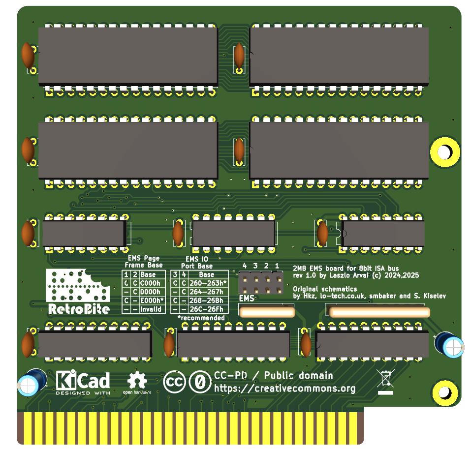

# 2MByte ISA EMS Expansion Card for IBM PC XT computers

## Introduction

This is a redesign of the **lo-tech.co.uk** [2Mb ISA EMS board](https://www.lo-tech.co.uk/wiki/Lo-tech_2MB_EMS_Board) with some changes:

- All thru-hole instead of SMD, while retaining a rather compact format
- Simplified address decoding and storage circuits for less chip count

The card was tested in modern replica of an XT computer like Xi8088 and Micro8088 without issues.

## Configuration

To configure the EMS, jumpers on J2 header are used.

Pins pairs 1 and 2 configure the Page Frame base address, while 3 and 4 configure the IO Port base address.

Page Frame Address:

| 1 | 2 | EMS Page Frame Base |
| - | - | ------------------- |
| X | X |        C000h        |
| - | X |        D000h        |
| X | - |        E000h        |
| - | - |       Invalid       |

Port Base Address

| 3 | 4 | EMS IO Port Base |
| - | - | ---------------- |
| X | X |     260-263h     |
| - | X |     264-267h     |
| X | - |     268-26Bh     |
| - | - |     26C-26Fh     |

 (-=no jumper (opened), X=jumper (closed))

## Usage

You need a **memory manager** to use this board. I'm including the `LTEMM` driver provided by lo-tech in this repository. Please refer to [this](https://www.lo-tech.co.uk/wiki/Terms_and_Conditions) page regarding the terms of use.

## Bill of Materials

All ICs are in DIP package.

- C1,C4 ,C5 ,C6, C7, C8, C9, C10, C11, C12: 100nF, ceramic
- C2, C3: 10uF / 50v electrolytic caps
- J2 2x4 2.5mm breakable header
- RN1: resistor network, 10k, bussed, 5 pins
- RN2: resistor network, 10k, bussed, 9 pins. 
- U1, U2, U3, U4: AS6C4008-55PCN (You don't need to fill all sockets: fit as much memory as you need starting from socket 1!)
- U5: 74LS139
- U6: 74LS245
- U7, U10: 74HCT688
- U8, U9: 74LS670
- ISA bracket: Keystone 9202, plus screws.

## Credits

- Thanks to [hkzab](https://github.com/hkzlab/ISA_EMS_2Mb) for publishing a similar design
- Thanks to [lo-tech.co.uk](https://www.lo-tech.co.uk/) for having published their schematics
- Thanks to [Sergey](http://www.malinov.com/Home/sergeys-projects) for all his projects!

